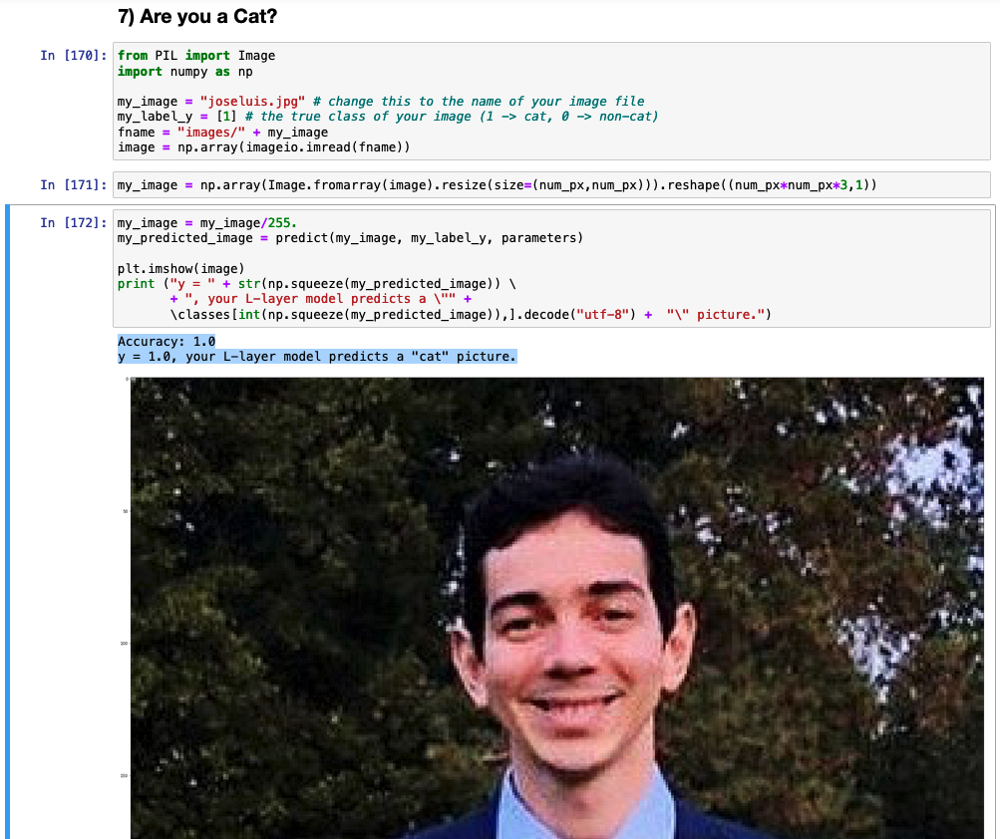

# Deep Neural Network for Image Classification: Application

## Project Description: 

Build a deep network, apply it to cat vs non-cat classification and improve the accuracy as compared to the previous logistic regression model. I will update this Notebook with more information for a multi-classification
embedding another database.

Adapted from my Projects & Solutions at Deep Learning Specialization at Coursera

### Goal:
- <b>Build and apply a deep neural network to supervised learning.</b>

Packages:
- [numpy](https://www.numpy.org/) is the fundamental package for scientific computing with Python.
- [matplotlib](http://matplotlib.org) is a library to plot graphs in Python.
- [h5py](http://www.h5py.org) is a common package to interact with a dataset that is stored on an H5 file.
- [PIL](http://www.pythonware.com/products/pil/) is used here to test your model with your own picture at the end.
- [imageo](https://pypi.org/project/imageio/) to resize the image. Check [imageo documentation](https://imageio.readthedocs.io/en/stable/)
- dnn_app_utils provides the functions implemented in the "Building your Deep Neural Network: Step by Step" assignment to this notebook.
- np.random.seed(1) is used to keep all the random function calls consistent. It will help us grade 


###### * Extra *

Apparently I am a Cat.

```py 
from PIL import Image
import numpy as np

my_image = "joseluis.jpg" # change this to the name of your image file 
my_label_y = [1] # the true class of your image (1 -> cat, 0 -> non-cat)
fname = "images/" + my_image
image = np.array(imageio.imread(fname))

my_image = np.array(Image.fromarray(image).resize(size=(num_px,num_px))).reshape((num_px*num_px*3,1))

my_image = my_image/255.
my_predicted_image = predict(my_image, my_label_y, parameters)

plt.imshow(image)
print ("y = " + str(np.squeeze(my_predicted_image)) \
       + ", your L-layer model predicts a \"" + 
       \classes[int(np.squeeze(my_predicted_image)),].decode("utf-8") +  "\" picture.")

```
Accuracy: 1.0
y = 1.0, your L-layer model predicts a "cat" picture. :audacious

 